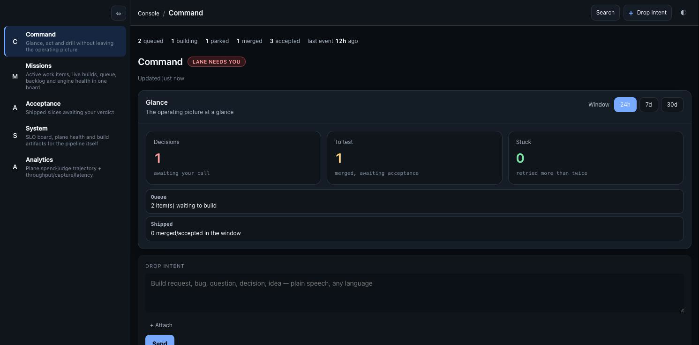

# loopkit

**Describe a change in plain English. loopkit plans it, builds it in an isolated git worktree,
proves it with your own test suite, and merges it — and only interrupts you for the calls a human
should actually make.**

Every step is an immutable event in one append-only ledger. Everything you look at — the board,
an item's timeline, the needs-you list — is just a projection of that log. It's what you get when
you treat *software delivery itself* as an event-sourced system.

## Who this is for

A solo operator on macOS, running the Claude CLI, who wants an agent's output gated by *their
own* deterministic test suite before anything reaches `main` — not a team platform, not a hosted
service, not a review-everything-yourself workflow either. If you already trust `npm test` (or
your project's equivalent) to catch a real regression, loopkit is the harness that makes an agent
prove it against that gate before it merges, and routes only the changes that actually need your
judgment back to you. See ["Honest scope"](#honest-scope) below for exactly what's proven today.


```bash
$ loopctl new "Add a deleteNote(id) function to src/notes.js with tests"
  → captured WI-001

$ loopctl beat reactor      # routes + queues it
$ loopctl beat dispatch     # builds in a worktree, runs your gate, merges on green
  → WI-001  captured → built → gated ✓ → merged into main

$ cd ~/my-notes-app && git log --oneline
  a1b9f4e  feat: add deleteNote(id) with tests   ← written, tested, and merged by the plane
```

### What just happened

- **You said one sentence.** No ticket, no branch, no PR ceremony.
- **It built in isolation.** A dedicated git worktree with an explicit file scope — parallel
  items can't trample each other, and a failed build leaves your tree clean.
- **Your test suite was the judge**, not the model's self-report. Nothing merges unless the gate
  is green.
- **You weren't interrupted** — because this change didn't need you. A change to money, auth, or
  a migration *would* have stopped and waited. That boundary is the whole point.

---

## Why this exists

Autonomous coding agents fail in boring ways long before they fail in interesting ones. What
broke for me was never the model's code — it was the **coordination layer** around it:

- **Mutable coordination state** (queues in markdown, status files, chat threads) silently lost
  or double-applied work the moment two things ran at once.
- **Silent state loss** — a crashed worker, an oversized payload, or a killed process could leave
  the system *confidently wrong* about what had happened.
- **No trust boundary** — either a human reviewed everything (and became the bottleneck) or
  nothing (and shipped regressions unseen).

loopkit is the invariant I adopted after those scars: **one append-only ledger, one fold,
deterministic beats — and an explicit, configurable boundary between what the plane may ship on
its own and what needs your eyes.**

## How it works

```
   intent (plain English)
      │
      ▼
 ┌──────────┐   append    ┌────────────────────┐   fold    ┌─────────────┐
 │ reactor   │──────────▶ │  work ledger        │─────────▶│ projections  │
 │ beat      │  events    │  (append-only,      │  (one     │ board · item │
 └──────────┘             │   monthly segments) │   fold)   │ timeline ·   │
      ▲                   └────────────────────┘           │ needs-you ·  │
      │ gate/merge/tier            ▲                        │ health       │
 ┌──────────┐   append             │                        └─────────────┘
 │ dispatch  │─────────────────────┘
 │ beat      │  builds each item in an ISOLATED GIT WORKTREE,
 └──────────┘  runs the target's deterministic gate, merges on green
```

- **The ledger is the only truth.** Beats and the CLI append events; nothing mutates in place. A
  crashed process changes nothing retroactively — recovery is just re-reading the log.
- **Worktree isolation.** Every build runs in its own git worktree with its own file scope
  (`Touches`). Parallel work items are disjoint by construction.
- **Deterministic gates.** An item merges only when the target's own gate command (its test
  suite) passes in the worktree. The gate is the arbiter, not the model.
- **Tiered acceptance — the human boundary.** Every merged item is classified by *what it
  actually changed* — the real `git diff` at merge time, not the item's own declared metadata,
  so a change that touched real code can never slip through as "nothing changed":

  | tier | what it is | what happens |
  |---|---|---|
  | `auto` | framework-internal, gate-proven | ships silently after a short window |
  | `optional` | non-surface code | ships after a longer window |
  | `review` | a declared product surface | **surfaces for your test** |
  | `must` | money · auth · migrations, or a failed quality judge | **waits for you, forever** |

  Acceptance routes *attention*. Merging and deploying are separate steps — v0.1 proves
  capture → build → gate → merge with **deploy off by default**. Merge ≠ ship.

- **Two orthogonal trust axes, not one list.** *Merge-trust* (what may auto-merge) and
  *test-visibility* (what you want to eyeball) are declared separately — a path can be trusted to
  merge **and** still surface for your test. Getting this collapsed into one list is how changes
  ship unseen; here the boundary is explicit config, not convention.
- **Self-heal basics.** A doctor pass detects orphaned builds, dead-process locks, and oversized
  events; the plane degrades and reports instead of wedging.
- **Sensitivity-aware model routing.** Every item carries a data-sensitivity tier
  (`public`/`internal`/`private`); the provider registry gates which model may serve which tier
  (`private` → local model), fail-closed. Run one provider with zero config, or split by role
  (cheap scout / volume builder / judge), quota lane, and sensitivity. Full boundary semantics:
  [docs/trust-boundaries.md](docs/trust-boundaries.md).

## Get pinged when it needs you

The point of tiered acceptance is that loopkit only interrupts you for the calls that need a
human — a **parked decision** or a halted build. When that happens it runs one configurable
command, your **notify hook**, with the message as its only argument (exit `0` = delivered):

```jsonc
// loopkit.config.json
{ "notifyHook": ".ai/notify-phone.sh" }   // a script in your plane repo; called as: hook "<message>"
```

There's **no bundled Telegram or email client, on purpose** — the hook is bring-your-own-channel,
so no third-party SDK or secret lives in the framework. Point it at whatever you already use:

```bash
# .ai/notify-phone.sh — Telegram bot; $1 is the message
#!/usr/bin/env bash
curl -fsS "https://api.telegram.org/bot$TG_BOT_TOKEN/sendMessage" \
  --data-urlencode "chat_id=$TG_CHAT_ID" \
  --data-urlencode "text=🔔 loopkit: $1" >/dev/null
```

```bash
# …or email, same contract
#!/usr/bin/env bash
printf 'Subject: loopkit needs you\n\n%s\n' "$1" | sendmail you@example.com
```

Set up the Telegram side once — message [@BotFather](https://t.me/botfather) → `/newbot` for a
token, then read your `chat_id` from `.../getUpdates`. Keep the token in your shell env, never in
the repo.

You watch the same blockers in the console's **needs-you** lane — the hook is just the push to
your phone:



## Try it

The exact sequence below drove a real worker end-to-end — intent → worktree build in the target
repo → its own test gate → merge into its `main`:

```bash
# 0. Build the engine
cd loopkit && npm install && (cd packages/core && npm run build)
LOOPCTL="node $(pwd)/packages/core/dist/cli.js"

# 1. Materialize the demo target (a tiny notes app with its own tests + loopkit.target.json)
bash examples/setup-demo.sh ~/loopkit-demo/notes

# 2. Create a plane (its own state lives here, separate from the target)
mkdir -p ~/loopkit-demo/plane && cd ~/loopkit-demo/plane && git init -b main
mkdir -p .ai/loops/prompts && cp <loopkit>/packages/core/prompts/*.md .ai/loops/prompts/
echo 'export LOOPKIT_AUTONOMY=on' > .ai/loops/config.env   # fail-safe: OFF until you arm it

# 3. Connect the target (prints its manifest — gate command, branch — for your review)
$LOOPCTL target add ~/loopkit-demo/notes

# 4. Drop intent, then run the two beats (normally these run on a scheduler)
$LOOPCTL new "Add a deleteNote(id) function to src/notes.js with tests"
$LOOPCTL beat reactor     # routes + queues the item
$LOOPCTL beat dispatch    # builds in a worktree OF THE TARGET, gates, merges into ITS main

# 5. See what happened
$LOOPCTL state && $LOOPCTL events --item WI-001
cd ~/loopkit-demo/notes && git log --oneline   # the worker's commit is in YOUR repo's history
```

Notes from real runs: the plane refuses to run agents until `LOOPKIT_AUTONOMY=on` (a fail-safe,
not a bug) · a target may carry `.claude/settings.json` to grant its workers project-scoped
permissions · avoid hosting targets under `/tmp` on macOS (symlink canonicalization confuses
worker sandboxes) · don't run the beats from inside another sandboxed agent session.

## The target contract

A repo becomes buildable by declaring a small, non-secret manifest (`loopkit.target.json`):
default branch, gate command, worktree prefix, and its three boundary lists (merge-trust
prefixes, test-visible surfaces, risk patterns). The plane's own state lives in a separate
*plane-home* directory — itself a git repo, so runtime state gets the same durability treatment
as code. `targetId` is in every event from birth; v0.1 drives **one** target. Multi-target is an
activation, not a rewrite. Design notes: [docs/event-model.md](docs/event-model.md).

## The method, not just the machinery

The plane encodes an opinionated delivery discipline:

1. **Event-model before coding** — a feature is mapped left-to-right (events → screens →
   commands → read models) before any code; the model doubles as the spec.
2. **Vertical slices** — every work item is a thin, end-to-end, independently revertable slice.
3. **One writer per boundary** — ledger appends are single-writer with PID-aware locking;
   parallel builds are `Touches`-disjoint by construction.
4. **The gate is the reviewer of record** — human attention goes to product judgment (the
   `review`/`must` tiers), not to re-checking what a test suite already proved.

The discipline itself — stated so it outlives the code — is
[docs/method.md](docs/method.md); [docs/hardening-audit.md](docs/hardening-audit.md) is it
applied: a 10-class incident catalog run proactively against the framework.

More: [the method](docs/method.md) · [the vision](docs/vision.md) ·
[operating model](docs/operating-model.md) · [event model](docs/event-model.md) ·
[trust boundaries](docs/trust-boundaries.md) · [hardening audit](docs/hardening-audit.md) ·
[agent integration](docs/agent-integration.md) · [knowledge index](docs/knowledge.md).

For Claude Code users the repo ships the operating discipline as slash commands
(`.claude/commands/`): `/drive` (attended coordinator mode over claims),
`/plane-check` (health triage), `/board` (the status window). Open a session in this repo and
they load automatically; see [agent integration](docs/agent-integration.md).

## Honest scope

This is an **experimental v0.1 preview** — built and exercised by one operator against one
target at a time, on macOS, with the Claude CLI as the worker. It delivers the slices of that
one workflow, and that is the entire claim. Not a product, not production-anything, not
provider-agnostic yet, no support SLA.

The target registry supports registering more than one repo (`target add` mints a distinct
`targetId` per repo, per [ADR-001](docs/decisions/ADR-001-one-plane.md)), but the exercised,
day-to-day workflow — the demo, the docs, the author's own usage — has only ever driven **one
target at a time**. Multi-target *scheduling* (dispatch deliberately prioritizing/interleaving
several targets' queues under one set of beats) is not yet built or proven; see
[docs/event-model.md](docs/event-model.md) for the contract.

| Works today | Not yet / not claimed |
|---|---|
| macOS (beats via launchd) | Linux / systemd runners |
| Claude CLI workers (Codex/Ollama adapters present, lightly exercised) | provider-agnostic guarantees |
| registering and building against one target at a time, end-to-end | multi-target scheduling, or any multi-target run in anger |
| solo-operator workflows | teams, RBAC, hosted anything |

This repo is published **read-only** as a reference / build-in-public project: fork, clone, and
star freely — see [CONTRIBUTING.md](CONTRIBUTING.md). Pull requests are closed automatically.

## License

MIT
