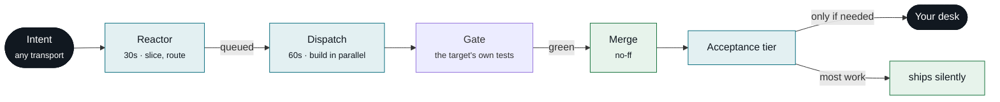
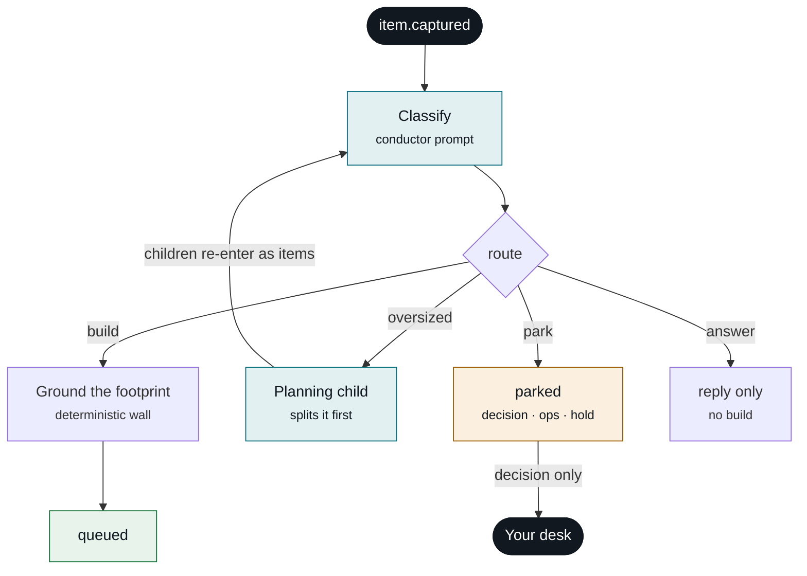
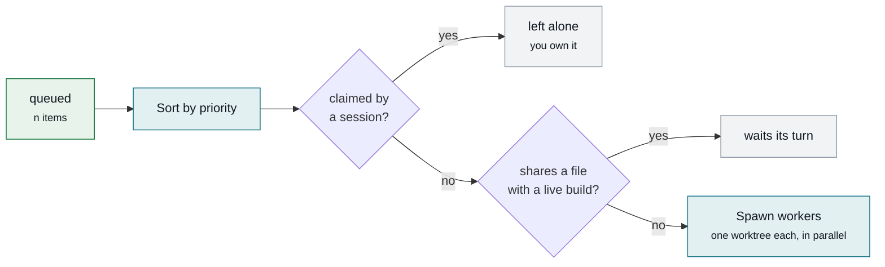
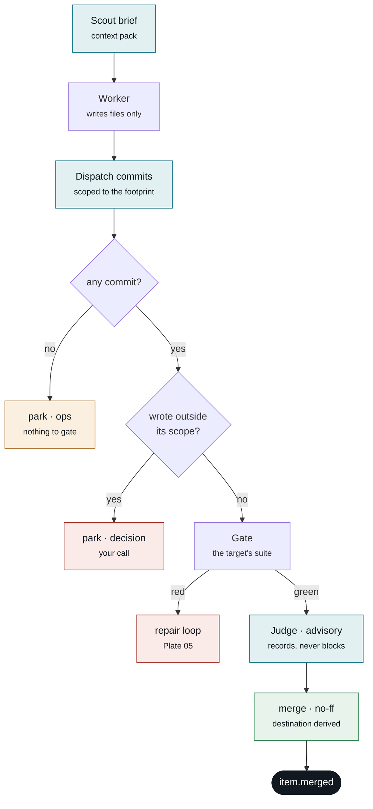
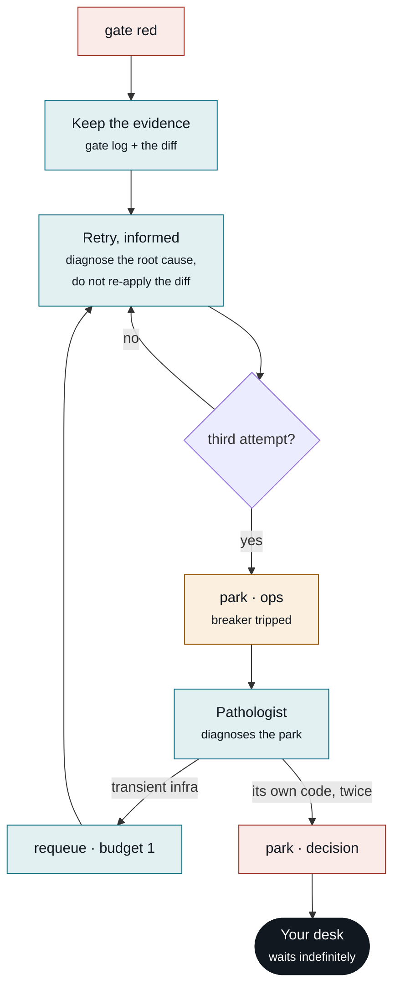
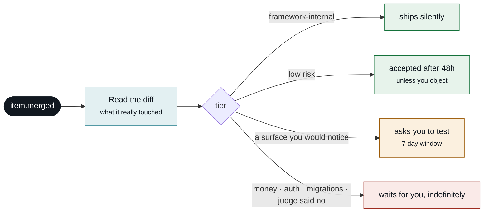
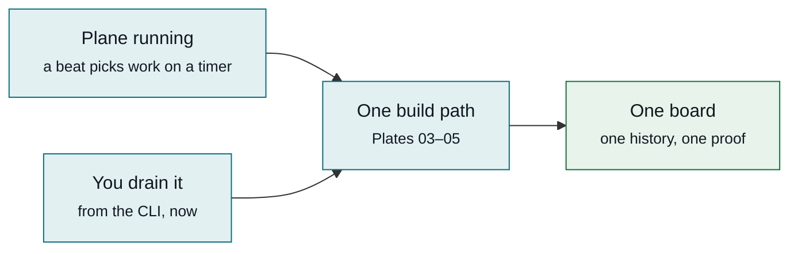

# The plane, plate by plate

Every path a work item can take, with the real thresholds and every decision point.

These diagrams render directly on GitHub — no build step, no hosting, no login. They live beside the
code they describe so they can be corrected in the same commit that changes behaviour.

**Status marks.** Where a subsystem was recently found inert or wrong, it is marked rather than drawn
as though it worked. A diagram that flatters the system is useless when something breaks.

| mark | meaning |
|---|---|
| ✅ | live and exercised on real work |
| 🔵 | recently fixed, barely exercised yet |
| 🟠 | known gap, recorded and unfixed |
| ⚪ | not built |

---

## Plate 01 — The whole plane

Six stages. Everything else in the system exists to make stages 3–5 survive a worker that is
occasionally wrong.

**What each stage owns**

- **Reactor** — turns prose into a work item with acceptance criteria and a declared file footprint
  (`Touches`). Slices anything too big into children.
- **Dispatch** — picks by priority, groups so no two builds share a file, spawns a worker per group in
  its own git worktree.
- **Gate** — the target repo's own test suite, run *before* the merge, never after.
- **Your desk** — only items whose tier says a human must look.

---

## Plate 02 — Reactor: routing, and the one place work gets sliced

Decomposition happens here or not at all. Once a builder is running it cannot re-scope its own item —
the cost of a durable orchestrator, recorded in [limitations](limitations.md).

- **Which route** — an LLM classifies, then a deterministic parser enforces the grammar. The model
  proposes; code decides what is legal.
- **Park kind is load-bearing.** Only `decision` reaches you. `ops` goes to the health lane, `hold` is
  a policy pause you set.
- The reactor also applies your verbs, merges approved branches, and nudges acceptance — same beat, not
  a separate loop.
- 🟠 A build worker has no capture verb, so a deferred remainder needs you to notice it. Intake-only
  slicing is a deliberate trade.

---

## Plate 03 — Dispatch: why parallel is safe, and what bounds it

Two builds may never share a file. That single rule removes the need for any model to reconcile
parallel work — combining becomes git's job.

**Numbers that actually bound this**

- ⚪ **There is no maximum-worker limit.** Disjointness is the only bound, so a well-partitioned queue
  can fan out very wide in a single beat. You pay in quota.
- A worker is re-spawned for an item up to a pick guard of **5** attempts — separate from the repair
  breaker on Plate 05.
- A `Touches`-less item is a wildcard and serialises the whole lane. Declaring a footprint is what
  buys parallelism.
- Claims are events, not conversation. That is the only reason a CLI drain and a running beat can
  safely overlap.

---

## Plate 04 — Build and guards: every check before a merge

The worker writes files. It does not commit, does not merge, and is not trusted to have stayed in
scope. Each diamond is a place work stops.

Also checked on the same path: a dirty tree, the wrong branch, the plane's own spine, and a
fabricated "done" with no commit behind it.

**Where the merge goes, and whether it pushes**

Both are **derived from the item's target**, never chosen: your repo's default branch, or the plane's
own. Push happens only where a target declares a remote.

- 🔵 **The scout ran zero times in 2,627 events** before being fixed — it lived in one code path while
  all real work went through another. Same cause for the judge.
- 🔵 The judge now **records** its verdict. Previously it ran, printed to a log nobody reads, and cost
  quota off-books.
- The scope check forgives a test file added beside the code it changed — in every repo shape, not just
  a monorepo. That exemption was monorepo-only until recently.

---

## Plate 05 — Failure and self-heal

A red gate is not a park. The worker gets the real test output and its own prior diff back, with an
instruction to diagnose the cause rather than retry the same patch.

Running alongside: orphaned-build detection, crashed-worker reaping, and a leaked-worktree sweep.

- 🔵 **The requeue arm above was unreachable.** Both decisions read one counter, so by the time a park
  happened the budget was already spent. Each now has its own.
- 🔵 The worktree sweeper used to force-delete directories containing **uncommitted work**, with no
  salvage, on a clock that never noticed edits in subdirectories. It now refuses a dirty tree, spares
  anything you have claimed, and measures staleness from real activity.
- 🟠 **A lone targeted detached build is never collected.** Dispatch returns early when nothing else is
  queued, before target-lane collection is reached — so one targeted item with an empty queue can sit
  in `building` forever, with no gate, no merge and no park. This is the shape of a queue that goes
  quiet for no visible reason.
- Two failures of an item's own code is terminal. It waits for you rather than looping.

---

## Plate 06 — Acceptance: why most merges never reach you

Tier is decided from the **real diff at merge time**, not from what the item claimed about itself — so
a change that touched real code cannot launder itself as harmless.

**Two dials, deliberately separate.** *Merge-trust* (what may land unattended) and *test-visibility*
(what you want to eyeball) are declared independently. Collapsing them into one list is exactly how
changes ship unseen.

The judge can only **raise** the tier, never lower it. A failed quality verdict pushes an item to your
desk; a passing one never buys a shortcut.

---

## Plate 07 — The only switch

There is no mode. There is a running plane and a stopped plane, and two ways to start work down one
pipeline.

Claims stop the two from colliding, so they may overlap — there is no switch to flip. Work you drove
by hand lands with the same trail as work done while you slept.

- 🟠 Today the CLI drain runs its own copy of this procedure rather than the same code. Collapsing them
  is the remaining work, deferred deliberately — it is a hot path, and the honest way to change it is
  with real builds running through it first. See [ADR-012](decisions/ADR-012-no-lanes.md).
- Everything that appears to differ between them — where a merge goes, whether it pushes, whether the
  plane's own spine is in scope — is a property of the **item**, not a mode you choose.

---

## Reading these when something goes wrong

Find the stop. Every diamond in Plates 04 and 05 is a place work halts, and each produces a named
reason on the item. Start from the reason, find its diamond, and the plate tells you what the plane
believed at that moment — then the ledger has the events to confirm or contradict it.

Thresholds shown are the shipped defaults. See [ADR-012](decisions/ADR-012-no-lanes.md) for where this
shape is heading and [limitations](limitations.md) for what it deliberately does not do.
