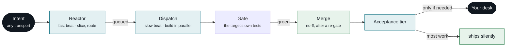
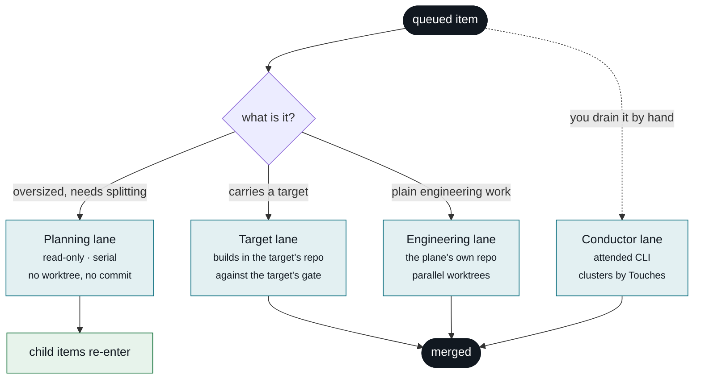
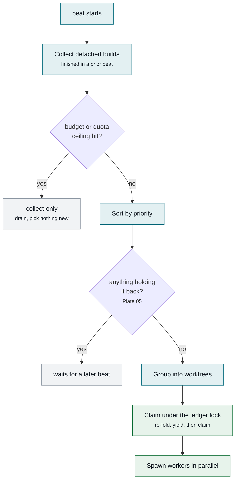
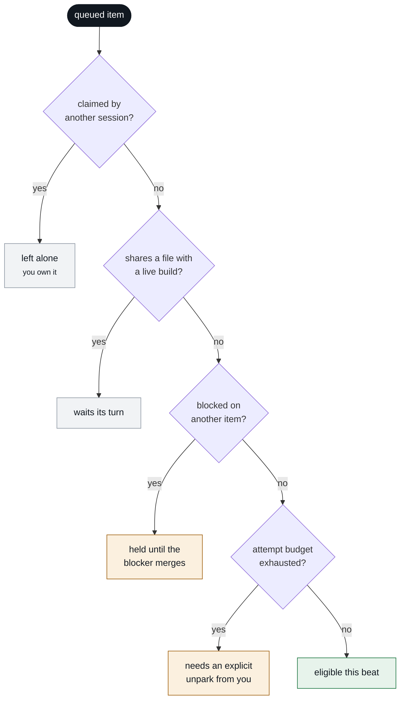
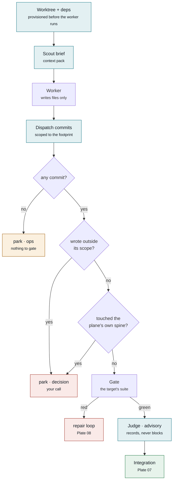
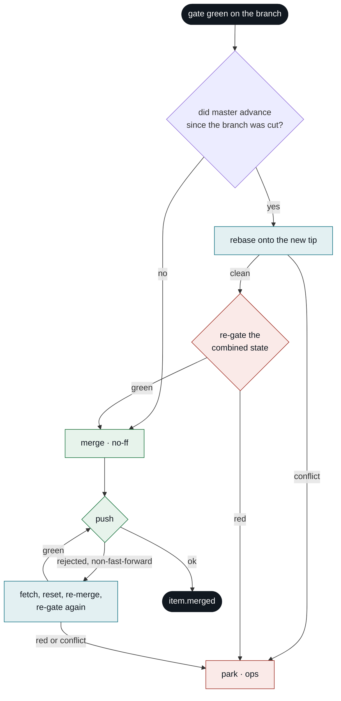
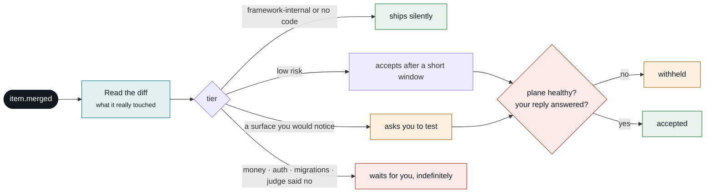
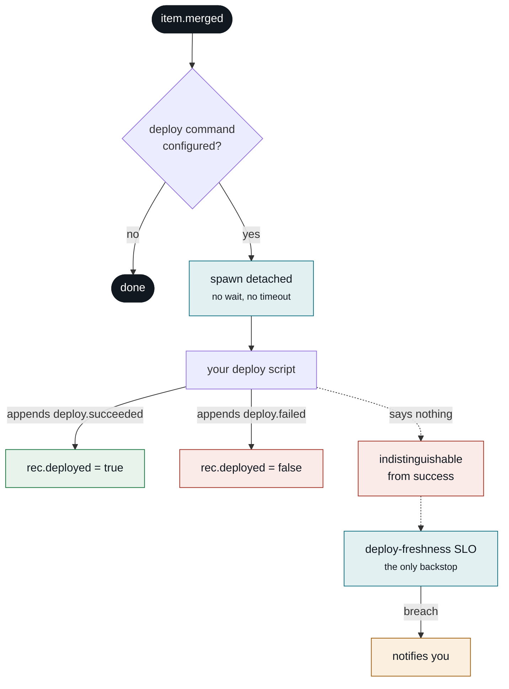
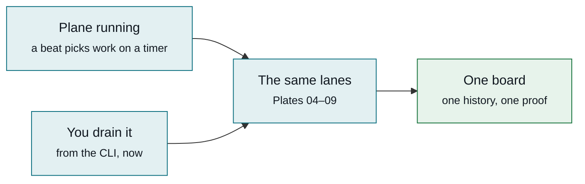

# The plane, plate by plate

Every path a work item can take, with the real thresholds and every decision point.

These diagrams render directly on GitHub — no build step, no hosting, no login. They live beside the
code they describe so they can be corrected in the same commit that changes behaviour.

**Status marks.** Where a subsystem was recently found inert or wrong, it is marked rather than drawn
as though it worked. A diagram that flatters the system is useless when something breaks.

| mark | meaning |
|---|---|
| ✅ | live and exercised on real work |
| 🔵 | recently fixed, or built and barely exercised yet |
| 🟠 | known gap, recorded and unfixed |
| ⚪ | not built, or off by default |

**Every number below is pinned to the constant it describes.** A bolded threshold on this page
carries an invisible marker naming its source constant, and
[`doc-claims.test.ts`](../packages/core/test/doc-claims.test.ts) fails CI when the two disagree —
the same discipline [`lane-matrix.md`](lane-matrix.md) already applies to the guard matrix. Every
`file.ts:NNN` citation is checked the same way: the test reads the cited line and asserts it still
contains the code named. This page drifted badly once; that is why.

---

## Plate 01 — The whole plane

Six stages. Everything else in the system exists to make stages 3–5 survive a worker that is
occasionally wrong.

**What each stage owns**

- **Reactor** — turns prose into a work item with acceptance criteria and a declared file footprint
  (`Touches`). Slices anything too big into children.
- **Dispatch** — picks by priority, groups so no two builds share a file, spawns a worker per group in
  its own git worktree.
- **Gate** — the target repo's own test suite, run *before* the merge, never after. Then run **again**
  if master moved underneath the branch — Plate 07.
- **Your desk** — only items whose tier says a human must look.

The two beats run on timers your host installs — 30 s and 60 s in the reference install. The interval
lives in the launchd plist, not in the framework, so it is not a constant this page can pin.

This plate is the shape of **one** lane. There are four, and they do not carry the same guards.

---

## Plate 02 — Four lanes, not one pipeline

The single most misleading thing the earlier version of this page did was imply one path with one
guard set. An item's lane is a property of the **item** — its target, and whether routing decided it
needed splitting first — and the lanes differ in which guards actually run.

**Which guards each lane actually runs is generated from source, not written here.** See
[`lane-matrix.md`](lane-matrix.md) — a table derived by static analysis of each lane's own function
span and pinned by its own drift test. If this prose and that table disagree, the table is right.

- **Planning** (`packages/core/src/beats/dispatch.ts:2185`<!--cite:runPlanningLane-->) — runs *before* the
  engineering and target picks, spawns serially, never opens a worktree and never writes a file. Its
  only output is child work items. Correspondingly it has no commit step, no gate and no judge.
- **Target** (`packages/core/src/beats/dispatch.ts:2634`<!--cite:runTargetLane-->) — a targeted item is
  built in **its own repo**, gated by **that target's** declared gate command, and merged into that
  target's default branch. It runs serially and never touches the plane's batch machinery.
- **Engineering** — the lane Plates 04–08 describe in detail. The only lane with the scout stage, the
  spine guard, a push step, and the post-integration re-gate.
- **Conductor** (`packages/core/src/conductor.ts:85`<!--cite:clusterByTouches-->) — the attended CLI
  drain. Clusters items by `Touches`, runs disjoint clusters concurrently and the wildcard cluster
  serially. Same ledger, same claims, same board.
- 🟠 Target and conductor still lack the post-integration re-gate, and both open their worktree from
  the repo's ambient `HEAD` rather than a declared default branch. Both are recorded in
  [limitations](limitations.md).

---

## Plate 03 — Reactor: routing, and the one place work gets sliced

Decomposition happens here or not at all. Once a builder is running it cannot re-scope its own item —
the cost of a durable orchestrator, recorded in [limitations](limitations.md).

- **Which route** — an LLM classifies, then a deterministic parser enforces the grammar. The model
  proposes; code decides what is legal.
- **Park kind is load-bearing.** Only `decision` reaches you. `ops` goes to the health lane, `hold` is
  a policy pause you set.
- The reactor also applies your verbs, merges approved branches, and nudges acceptance — same beat, not
  a separate loop.
- 🔵 A build worker still has no capture verb and cannot queue anything. But a remainder it declares
  in its manifest's structured `deferred` field is auto-captured at merge as a child item — `captured`,
  never queued, so it re-enters this same routing (WI-177). Intake-only slicing stays the deliberate
  trade; what changed is that the remainder no longer depends on you reading a run directory.
- 🟠 A reply that steers an in-flight item appends `item.respec`, which amends the item's `spec`
  (`packages/core/src/fold.ts:1377`<!--cite:foldRespec-->) while boards keep rendering its original
  `text`. The builder gets the corrected instruction; your board can still show you the old one.

---

## Plate 04 — Dispatch: what actually gets picked

Priority is where the picker starts, not where it ends. Before anything spawns, the beat drains what a
previous beat left running, checks whether it is allowed to spend at all, and reserves what it picked.

**Claim arbitration is not a yes/no read.** The picker's fold is stale by the time it spawns, so
dispatch re-reads and re-folds the ledger **under the ledger lock**, drops any item a foreign session
claimed in that window, and claims every survivor in the same locked append before spawning anything
(`packages/core/src/beats/dispatch.ts:455`<!--cite:claimArbitration-->, [ADR-007](decisions/ADR-007-claim-arbitration.md)).
Both picking lanes — engineering and target — go through that one terminal, under one per-beat
pseudo-session, so the reservation cannot drift between them (WI-186).
That is the only reason a CLI drain and a running beat can overlap safely.

**Degraded modes stop picks without stopping the beat.** A daily-spend ceiling, or any
`provider:window` quota reading at or above **80**<!--pin:quotaThresholdPct-->% of its ceiling
(`packages/core/src/beats/dispatch.ts:3161`<!--cite:quotaDegraded-->), flips dispatch to collect-only for
that beat: already-finished detached builds still drain, nothing new spawns. Fail-open — no quota
snapshots means no degradation.

**Provider health is a chain, not a single provider.** The registry walks the configured chain; an
auth failure marks the current provider unhealthy and falls over to the next
(`packages/core/src/beats/dispatch.ts:3321`<!--cite:providerFallback-->), and a later successful beat
clears the marker. With no healthy provider for an item's sensitivity tier, the item parks rather than
routing to a disallowed one.

**Numbers that bound this**

- ⚪ **There is no maximum-worker limit.** Disjointness is the only bound, so a well-partitioned queue
  can fan out very wide in a single beat. You pay in quota.
- Claims are leases. An attended session's claim runs **60**<!--pin:DEFAULT_CLAIM_TTL_MINUTES--> minutes;
  dispatch claims its own picks for the build timeout of **40**<!--pin:buildTimeoutMinutes--> minutes
  plus five, so a crashed beat's claims expire on their own rather than needing a cleanup.
- ⚪ **Batch co-location is off by default.** Items per worktree defaults to
  **1**<!--pin:batchMaxItems-->. Raised above 1, dispatch deliberately pulls *overlapping*, small items
  — sonnet-model, not a blocker, spec under **1500**<!--pin:BATCH_SPEC_MAX--> characters — into one
  worktree so they share one gate and one merge
  (`packages/core/src/beats/dispatch.ts:3281`<!--cite:batchColocation-->). Overlap therefore has two
  outcomes, not one: co-location if it is enabled and the items are small, waiting otherwise.
- 🔵 Builds spawned in one beat are collected by a later one via on-disk exit files, so a long build
  does not pin the beat that started it ([ADR-008](decisions/ADR-008-detached-dispatch-staging.md)).

---

## Plate 05 — What makes an item wait

`Touches` file-disjointness is the famous constraint but it is not the only one, and reading it as the
only one is how you conclude the plane cannot express "do B after A". It can.

- **Semantic dependency is real.** An item can be `blocked` on another item, and the reactor releases
  it automatically the moment the blocker **merges**
  (`packages/core/src/beats/reactor.ts:2098`<!--cite:blockedVictimRelease-->). The plane creates these
  links itself: when the pathologist decides a park was caused by a plane bug rather than the item's
  own code, it captures a repair item and blocks the victim on it — Plate 08.
- **A blocker that never merges does not strand the victim silently.** After
  **24**<!--pin:blockedWaitTimeoutHours--> hours parked, the victim is re-parked as a `decision` with
  the blocker's state attached, so it reaches your desk instead of waiting forever
  (`packages/core/src/beats/reactor.ts:2122`<!--cite:blockedVictimTimeout-->).
- A `Touches`-less item is a wildcard and serialises the whole lane. Declaring a footprint is what
  buys parallelism.
- The attempt budget here is dispatch's pick guard of **5**<!--pin:BUILDER_BREAKER_N--> —
  distinct from the three other counters on Plate 08.

---

## Plate 06 — Build and guards: every check before a merge

The worker writes files. It does not commit, does not merge, and is not trusted to have stayed in
scope. Each diamond is a place work stops.

Also checked on the same path: a dirty tree, the wrong branch, and a fabricated "done" with no commit
behind it.

**Two different scopes, easily confused.** What dispatch is willing to **commit** is the union of the
item's declared `Touches` prefixes and the exact paths the worker reported in its manifest
(`packages/core/src/beats/dispatch.ts:1465`<!--cite:planScopedCommit-->) — anything else stays
uncommitted and is reported as residue. What counts as an **overstep** is narrower: a changed file
outside the declared prefixes, minus a test-file exemption and minus paths you previously approved
(`packages/core/src/beats/dispatch.ts:1422`<!--cite:checkTouchesOverstep-->). The worker may also propose
the commit subject; dispatch uses it verbatim when present.

**The spine guard** (`packages/core/src/beats/dispatch.ts:1344`<!--cite:checkSpine-->) parks any diff
touching the plane's own configured spine pattern for your decision. It is an engineering-lane guard
— a target repo has no plane-spine concept.

**Where the merge goes, and whether it pushes**

Both are **derived from the item's target**, never chosen: your repo's default branch, or the plane's
own. Push happens only where a target declares a remote.

- 🔵 **The scout ran zero times in 2,627 events** before being fixed — it lived in one code path while
  all real work went through another. Same cause for the judge.
- 🔵 The judge now **records** its verdict. Previously it ran, printed to a log nobody reads, and cost
  quota off-books. It is not a thin check: the prompt requires a `VERDICT`, a `CONFIDENCE`, and
  explicit `SPEC_SATISFIED` / `SCOPE_CREEP` / `TEST_THEATRE` calls, a deterministic wall parses them,
  and `loopctl verdicts` reports how well they agreed with your own accept/reject decisions.
- 🟠 **The judge is unarmed on purpose, and nothing states when it would be armed.** Blocking mode is
  described in code as a future step "gated on calibration"
  (`packages/core/src/judge.ts:4`<!--cite:judgeAdvisoryOnly-->), but no criterion for reaching that
  gate is written anywhere — not in code, not here. And since the judge only began recording verdicts
  at all recently, there is almost nothing yet to calibrate against. Read "advisory" as *measured and
  deliberately not yet trusted*, not as *absent*.
- The judge's one lever today is the acceptance floor — Plate 09.
- The scope check forgives a test file added beside the code it changed — in every repo shape, not just
  a monorepo. That exemption was monorepo-only until recently.
- 🔵 A crashed or stalled worker has its uncommitted work captured as a salvage patch before the
  worktree is removed (`packages/core/src/beats/dispatch.ts:3973`<!--cite:salvageOnCrash-->), and the next
  attempt resumes from it.

---

## Plate 07 — Integration: the gate runs again

Nothing in this system reaches master on the strength of a gate that ran against a base which has
since moved. This is the strongest correctness property the plane has, and no earlier version of this
page drew it.

- The invariant: **no build reaches master without a gate covering every commit that landed since its
  branch point**, including parallel merges from the same beat
  (`packages/core/src/beats/dispatch.ts:4407`<!--cite:postIntegrationRegate-->).
- The push race is a *second*, later collision — master moved between the local merge and the push.
  Recovery re-fetches, hard-resets the primary tree onto the new tip
  (`packages/core/src/beats/dispatch.ts:4593`<!--cite:pushRaceReset-->), re-merges the approved branch and
  re-gates against the **fresh** base before retrying the push
  (`packages/core/src/beats/dispatch.ts:4619`<!--cite:pushRaceRegate-->).
- Every failure here is a park, never a force. A conflict or a red re-gate stops the item; nothing is
  merged past a disagreement.
- 🟠 This whole plate is engineering-lane only. See [limitations](limitations.md) for the target and
  conductor lanes.

---

## Plate 08 — Failure and self-heal

A red gate is not a park. The worker gets the real test output and its own prior diff back, with an
instruction to diagnose the cause rather than retry the same patch.

**There are four independent counters here, and they are deliberately not one.** Conflating two of
them is what made the transient-requeue arm unreachable for months: both decisions read the same
counter, so by the time a park happened the budget was already spent.

| counter | value | what it bounds |
|---|---|---|
| dispatch pick guard | **5**<!--pin:BUILDER_BREAKER_N--> | attempts before dispatch stops picking the item at all; only an explicit unpark from you resets it |
| doctor breaker | **3**<!--pin:breakerN--> | crash/stall reaps, and transient ops-park requeues, before the item parks as exhausted |
| transient-requeue budget | **1**<!--pin:maxTransientRequeues--> | how often the pathologist may re-queue the same spec after diagnosing transient infrastructure |
| gate-timeout retries | **3**<!--pin:MAX_TRANSIENT_TIMEOUT_RETRIES--> | a gate that *timed out* — a different signal from a gate that went red |

- **The plane files its own bugs.** When the pathologist classifies a park as a plane infrastructure
  bug it allocates a new work item, queues it, and blocks the victim on it
  (`packages/core/src/beats/reactor.ts:2344`<!--cite:repairItemCapture-->). That never reaches your desk
  as a decision; it reaches the board as work.
- A repeated *identical* failure fingerprint trips a thrashing park regardless of the retry counters —
  "same cause again" is a different signal from "ran out of retries".
- Running alongside on every reactor beat: orphaned-build detection, crashed-worker reaping, stale
  session-claim reaping (`packages/core/src/beats/reactor.ts:3477`<!--cite:staleClaimReap-->), and a
  leaked-worktree sweep.
- 🔵 The worktree sweeper used to force-delete directories containing **uncommitted work**, with no
  salvage, on a clock that never noticed edits in subdirectories. It now refuses a dirty tree, spares
  anything you have claimed, and measures staleness from real activity.
- 🔵 **A lone detached targeted build used to strand in `building` forever** — no gate, no merge, no
  park, and a queue that went quiet for no visible reason. A guard existed that runs the target lane
  when a prior beat left a detached targeted build in flight
  (`packages/core/src/beats/dispatch.ts:3120`<!--cite:detachedTargetGuard-->, per
  [ADR-008](decisions/ADR-008-detached-dispatch-staging.md) §3) but it sat *behind* the beat's early
  returns, so it was unreachable in exactly its own scenario: the generic collector deliberately skips
  targeted items, correctly, since they merge into a different repo
  (`packages/core/src/beats/dispatch.ts:2915`<!--cite:collectorSkipsTargets-->), leaving nothing
  collected and nothing queued. WI-178 hoisted the guard above **four** such returns — empty queue,
  daily budget, quota pressure, and all-groups-conflicting — each of which stranded the identical
  shape. Deliberately a *reachability* fix and not a dwell timeout: the doctor already owns the
  ceilings on `building`, and a timer here would have reaped a build that was about to merge.
- Two failures of an item's own code is terminal. It waits for you rather than looping.

---

## Plate 09 — Acceptance: why most merges never reach you

Tier is decided from the **real diff at merge time**, not from what the item claimed about itself — so
a change that touched real code cannot launder itself as harmless.

**The windows.** `auto` accepts after **2**<!--pin:autoAfterHours--> hours, `optional` after
**48**<!--pin:optionalAfterHours-->, `review` after **168**<!--pin:reviewAfterHours--> — seven days.
`must` never auto-accepts at all
(`packages/core/src/beats/reactor.ts:3968`<!--cite:mustNeverAutoAccepts-->).

Those last two are **starting** windows, not fixed ones: the reactor self-tunes them from your own
verdict history — a clean-accept streak shrinks the window, a reported problem grows it — bounded by a
ceiling of **336**<!--pin:windowCeilingHours--> hours. What you actually experience is calibrated to
how often you have found something wrong.

**Two gates sit in front of the non-`auto` tiers.**

- **Plane health.** If the reactor beat, the dispatch beat or the instance probes are not affirmatively
  `met`, non-`auto` acceptance is withheld and a visible reason is appended once, on the transition
  (`packages/core/src/beats/reactor.ts:3621`<!--cite:acceptWithholdKeys-->). **Unknown is not healthy** —
  a probe that errors withholds, because absent evidence is not green evidence. The `auto` tier is
  never withheld: there is nothing to test, so plane health protects nothing for it.
- **Your unanswered reply.** An item with an open reply or an unresolved proposal is held rather than
  accepted, so work you are actively steering is not silently closed behind you. That hold expires
  after **72**<!--pin:holdMaxHours--> hours so a never-answered reply cannot pin an item forever.

**Two dials, deliberately separate.** *Merge-trust* (what may land unattended) and *test-visibility*
(what you want to eyeball) are declared independently. Collapsing them into one list is exactly how
changes ship unseen.

The judge can only **raise** the tier, never lower it
(`packages/core/src/acceptance.ts:85`<!--cite:overseerFloor-->). A failed verdict, an unsatisfied spec,
suspected test theatre or a confidence below the floor pushes an item to your desk; a passing verdict
never buys a shortcut. A judge that errored out is treated as an evidence gap, not a pass.

Note what tiering is and is not: it is computed **after** the merge and governs what you are *told*,
not what is *permitted to land*. ⚪ One optional, **default-off** exception: `preMergeRiskHold.enabled`
re-runs the same classifier over the *pre*-merge diff and **parks** an item whose paths hit a `must`
risk class instead of merging it (WI-180). It is a pattern hold, not an authorization model — no
identity, no approval event, no RBAC. See [limitations](limitations.md).

---

## Plate 10 — After the merge: deploy

Merging is where the plane's guarantees stop. Everything past this point is observational, and the
honest version of this plate is mostly a list of things that are not checked.

- **The deploy is fire-and-forget by construction.** It is spawned detached, with stdio ignored,
  unreferenced, with no timeout and nothing awaiting it
  (`packages/core/src/beats/worktree-deps.ts:400`<!--cite:fireDeployOnMerge-->). The plane passes the
  merged item ids in the environment; **your** script is what appends `deploy.succeeded` or
  `deploy.failed`.
- Those events do exactly one thing when they arrive: set the item's `deployed` flag
  (`packages/core/src/fold.ts:1363`<!--cite:foldDeploySucceeded-->). Nothing branches on it.
- ✅ **The `deployed` flag on `item.merged` is uniformly `false`, on every lane.** A merge observes
  that code landed, never that it deployed; `deploy.succeeded` / `deploy.failed` are the sole
  authority. It carried opposite meanings in two lanes until WI-176 — the target lane wrote
  `true` whenever a deploy command was merely *configured* — so a board read before that fix could
  not be trusted on this field.
- 🟠 **A deploy script that never reports is indistinguishable from one that succeeded**, at the item
  level. The only thing that notices is a deploy-freshness SLO row
  (`packages/core/src/slo.ts:1222`<!--cite:deployProbe-->): the deployed checkout may lag master by
  **1**<!--pin:deployBehindHours--> hour, amber at **0.8**<!--pin:atRiskFraction--> of that. A breach
  is edge-triggered and **notifies** — it does not park the item, and it does not withhold its
  acceptance. It also needs a deploy root configured; without one the row reads `unknown`.
- ⚪ **There is no automatic rollback anywhere.** A merge's `certification.rollback` is a string the
  worker wrote and you read (`packages/core/src/fold.ts:705`<!--cite:certificationRollback-->). Nothing
  executes it.

---

## Plate 11 — The only switch

There is no mode. There is a running plane and a stopped plane, and two ways to start work down the
lanes on Plate 02.

Claims stop the two from colliding, so they may overlap — there is no switch to flip. Work you drove
by hand lands with the same trail as work done while you slept.

- 🟠 Today the CLI drain runs its own copy of this procedure rather than the same code
  (`packages/core/src/conductor.ts:436`<!--cite:conductorWorktreeHead-->). Collapsing them is the
  remaining work, deferred deliberately — it is a hot path, and the honest way to change it is with
  real builds running through it first. See [ADR-012](decisions/ADR-012-no-lanes.md), and
  [`lane-matrix.md`](lane-matrix.md) for what the copy currently does and does not carry.
- Everything that appears to differ between them — where a merge goes, whether it pushes, whether the
  plane's own spine is in scope — is a property of the **item**, not a mode you choose.

---

## Reading these when something goes wrong

Find the stop. Every diamond in Plates 06–08 is a place work halts, and each produces a named reason on
the item. Start from the reason, find its diamond, and the plate tells you what the plane believed at
that moment — then the ledger has the events to confirm or contradict it.

If the queue has simply gone quiet with nothing on your desk, the candidates are, in order: an item
waiting on Plate 05, a degraded pick mode on Plate 04, and the unreachable-collection gap on Plate 08.

Thresholds shown are the shipped defaults, pinned to source by
[`doc-claims.test.ts`](../packages/core/test/doc-claims.test.ts). See
[`lane-matrix.md`](lane-matrix.md) for the generated per-lane guard table,
[ADR-012](decisions/ADR-012-no-lanes.md) for where this shape is heading, and
[limitations](limitations.md) for what it deliberately does not do.
