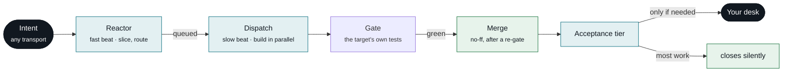
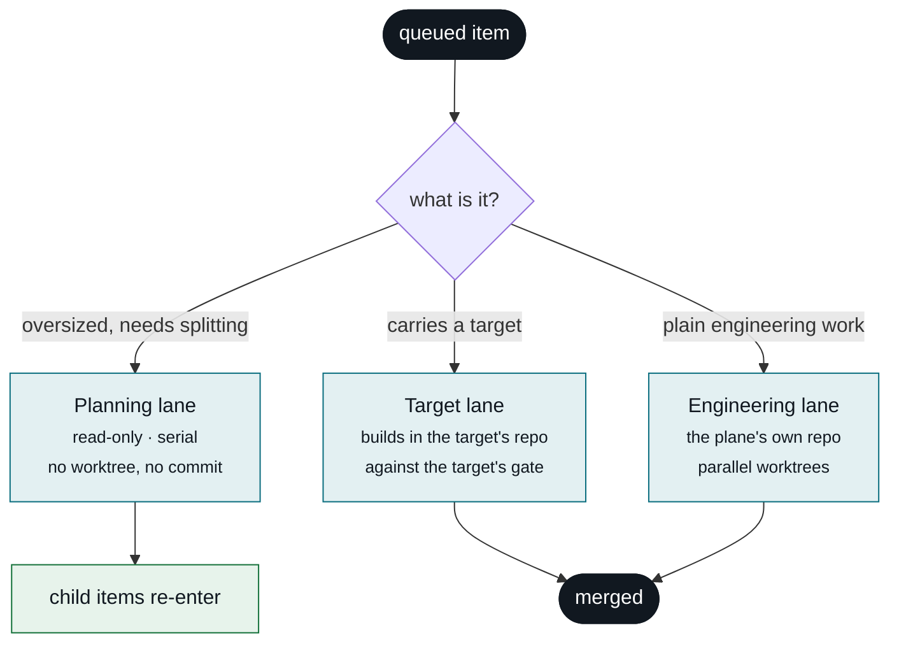
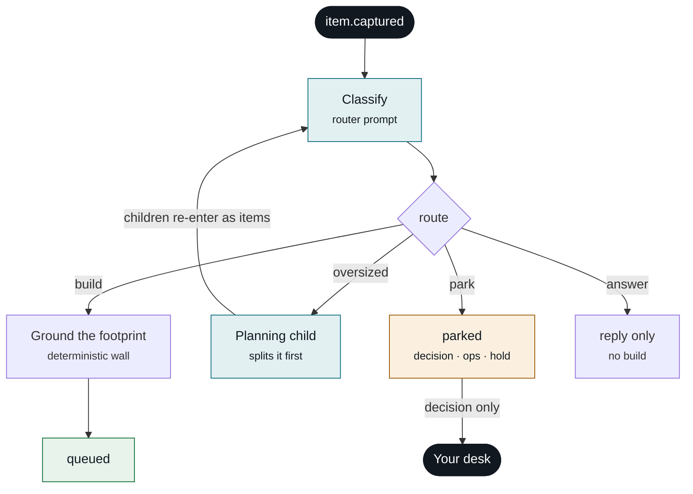
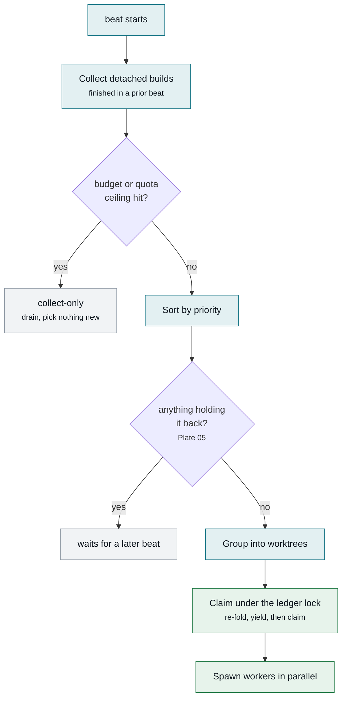
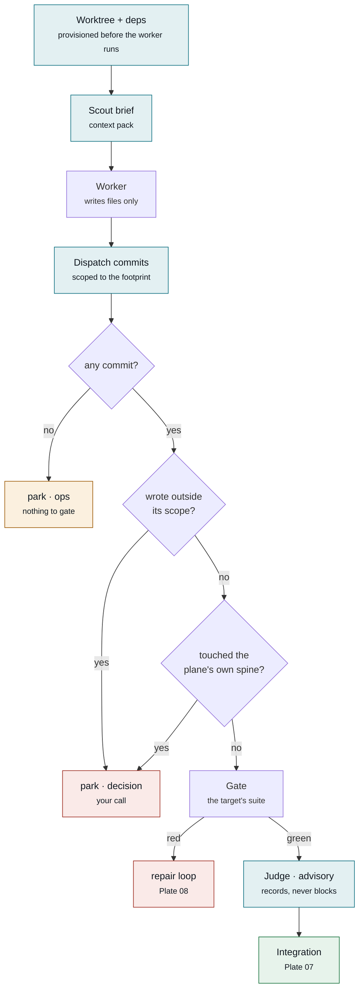
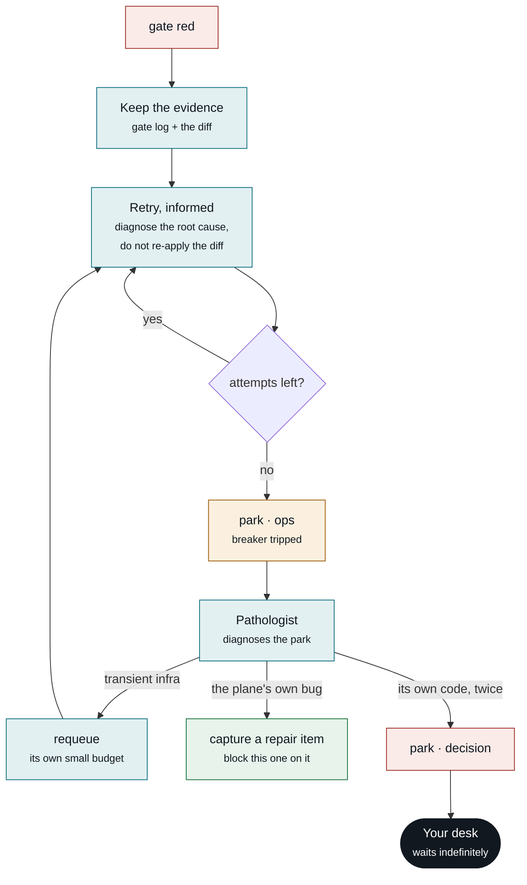
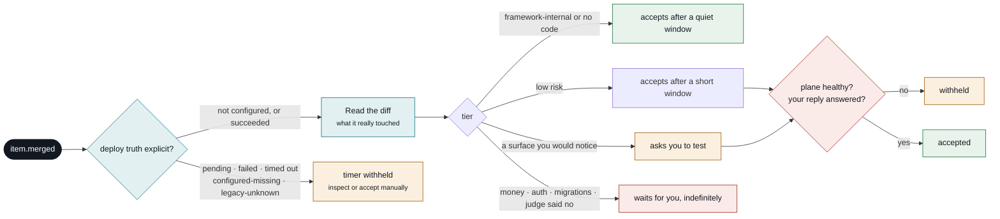
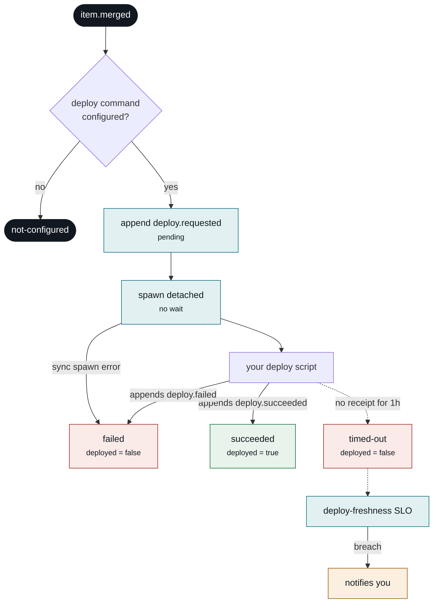
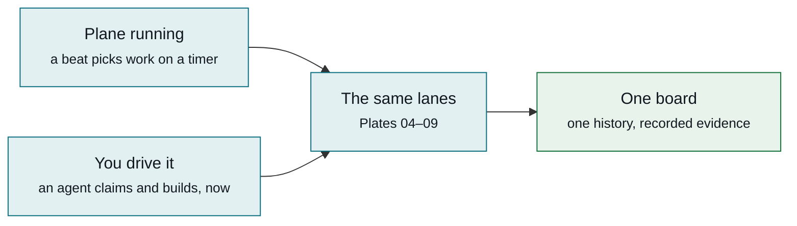

# The plane, plate by plate

Every path a work item can take, with the real thresholds and every decision point.

These diagrams render directly on GitHub — no build step, no hosting, no login. They live beside the
code they describe so they can be corrected in the same commit that changes behaviour.

**Status marks.** Where a subsystem was recently found inert or wrong, it is marked rather than drawn
as though it worked. A diagram that flatters the system is useless when something breaks.

| mark | meaning |
|---|---|
| ✅ | live and exercised on real work |
| 🔵 | recently fixed, or built and barely exercised yet |
| 🟠 | known gap, recorded and unfixed |
| ⚪ | not built, or off by default |

**Every number below is pinned to the constant it describes.** A bolded threshold on this page
carries an invisible marker naming its source constant, and
[`doc-claims.test.ts`](../packages/core/test/doc-claims.test.ts) fails CI when the two disagree —
the same discipline [`lane-matrix.md`](lane-matrix.md) already applies to the guard matrix. Every
`file.ts:NNN` citation is checked the same way: the test reads the cited line and asserts it still
contains the code named. Sentences that assert a **capability** rather than a number carry the same
kind of marker, bound to the symbol that backs them — this page claimed the reactor produced
acceptance criteria for weeks before any such field existed, so a described-but-absent feature now
fails CI too. This page drifted badly once; that is why.

---

## Plate 01 — The whole plane

Six stages. Everything else in the system exists to make stages 3–5 survive a worker that is
occasionally wrong.

**What each stage owns**

- **Reactor** — turns prose into a work item carrying a free-prose `spec`, a short list of
  falsifiable **acceptance criteria**<!--exists:itemCriteriaField-->, and a declared file footprint
  (`Touches`). The criteria are authored here, from the request text alone and *before any build
  exists*; an item may not reach `queued` without them
  (`packages/core/src/criteria.ts:178`<!--cite:criteriaGate-->). That ordering
  is the point — it is what stops the bar drifting toward whatever the build found convenient.
  Slices anything too big into children.
- **Dispatch** — picks by priority, groups so no two builds share a file, spawns a worker per group in
  its own git worktree.
- **Gate** — the target repo's own test suite, run on the build and, for target delivery, on the
  exact no-fast-forward merge candidate before its ref is published. A moving destination causes
  a new candidate and a new gate — Plate 07.
- **Your desk** — only items whose tier says a human must look.

The two beats run on timers your host installs — 30 s and 60 s in the reference install. The interval
lives in the launchd plist, not in the framework, so it is not a constant this page can pin.

This plate is the shape of **one** lane. There are three, and they do not carry the same guards.

---

## Plate 02 — Three lanes, not one pipeline

The single most misleading thing the earlier version of this page did was imply one path with one
guard set. An item's lane is a property of the **item** — its target, and whether routing decided it
needed splitting first — and the lanes differ in which guards actually run.

**Which guards each lane actually runs is generated from source, not written here.** See
[`lane-matrix.md`](lane-matrix.md) — a table derived by static analysis of each lane's own function
span and pinned by its own drift test. If this prose and that table disagree, the table is right.

- **Planning** (`packages/core/src/beats/dispatch.ts:2337`<!--cite:runPlanningLane-->) — runs *before* the
  engineering and target picks, spawns serially, never opens a worktree and never writes a file. Its
  only output is child work items. Correspondingly it has no commit step, no gate and no judge.
- **Target** (`packages/core/src/beats/dispatch.ts:2997`<!--cite:runTargetLane-->) — a targeted item is
  built in **its own repo**, gated by **that target's** declared gate command, and merged into that
  target's default branch. It runs serially and never touches the plane's batch machinery. At the
  merge terminal it re-reads that default branch; if it moved, the target lane rebases, recomputes
  the build's actual changed files, constructs the exact no-fast-forward candidate and runs the
  target gate on that exact commit. Publication is an atomic compare-and-swap; a losing writer
  loops through replay, candidate construction and gating again
  (`packages/core/src/beats/dispatch.ts:2780`<!--cite:targetPostIntegrationRegate-->).
- **Engineering** — the lane Plates 04–08 describe in detail. The only lane with the scout stage, the
  spine guard and a push step; it shares the post-integration re-gate invariant with target.
- An **attended drain** is not a fourth lane. When you drive the plane by hand, a coordinator agent
  claims items through the same lease kernel ([ADR-007](decisions/ADR-007-claim-arbitration.md)),
  builds them in worktrees and lands `item.merged` on the same board. There is no separate code path
  for it — the CLI drain that used to be one was deleted in
  [ADR-013](decisions/ADR-013-delete-the-conductor.md) after never producing a single ledger event;
  the `Touches` clustering it offered lives on in the engineering lane as batch co-location, though
  today that is reachable only for untargeted items — the target lane above builds serially and never
  calls it (see ADR-013's amendment).
---

## Plate 03 — Reactor: routing, and the one place work gets sliced

Decomposition happens here or not at all. Once a builder is running it cannot re-scope its own item —
the cost of a durable orchestrator, recorded in [limitations](limitations.md).

- **Which route** — an LLM classifies, then a deterministic parser enforces the grammar. The model
  proposes; code decides what is legal.
- **Park kind is load-bearing.** Only `decision` reaches you. `ops` goes to the health lane, `hold` is
  a policy pause you set.
- The reactor also applies your verbs, merges approved branches, and nudges acceptance — same beat, not
  a separate loop.
- 🔵 A build worker still has no capture verb and cannot queue anything. But a remainder it declares
  in its manifest's structured `deferred` field is auto-captured at merge as a child item — `captured`,
  never queued, so it re-enters this same routing (WI-177). Intake-only slicing stays the deliberate
  trade; what changed is that the remainder no longer depends on you reading a run directory.
- ✅ A reply that steers an in-flight item appends `item.respec`, which amends both the item's `spec`
  and its acceptance criteria (`packages/core/src/fold.ts:1469`<!--cite:foldRespec-->), and every
  operator-facing surface renders the amended pair — never the superseded capture text. Criteria are
  **replaced wholesale, not merged**, so a promise you withdrew really leaves the screen: accepting a
  slice against a bar nobody is still making is the failure this rule exists to prevent. (This page
  previously said boards kept showing the original text. That stopped being true when the surfaces
  were fixed to prefer `spec`; the entry had simply not been corrected.)

---

## Plate 04 — Dispatch: what actually gets picked

Priority is where the picker starts, not where it ends. Before anything spawns, the beat drains what a
previous beat left running, checks whether it is allowed to spend at all, and reserves what it picked.

**Claim arbitration is not a yes/no read.** The picker's fold is stale by the time it spawns, so
dispatch re-reads and re-folds the ledger **under the ledger lock**, drops any item a foreign session
claimed in that window, and claims every survivor in the same locked append before spawning anything
(`packages/core/src/beats/dispatch.ts:473`<!--cite:claimArbitration-->, [ADR-007](decisions/ADR-007-claim-arbitration.md)).
Both picking lanes — engineering and target — go through that one terminal, under one per-beat
pseudo-session, so the reservation cannot drift between them (WI-186).
That is the only reason a CLI drain and a running beat can overlap safely.

**Degraded modes stop picks without stopping the beat.** A daily-spend ceiling, or any
`provider:window` quota reading at or above **80**<!--pin:quotaThresholdPct-->% of its ceiling
(`packages/core/src/beats/dispatch.ts:3524`<!--cite:quotaDegraded-->), flips dispatch to collect-only for
that beat: already-finished detached builds still drain, nothing new spawns. Fail-open — no quota
snapshots means no degradation.

**Provider health is a chain, not a single provider.** In dispatch, the auth preflight and a
mid-build auth failure mark the current builder provider unhealthy; preflight then falls over to the
next tool-capable provider
(`packages/core/src/beats/dispatch.ts:3357`<!--cite:providerFallback-->), and a later successful
dispatch preflight clears the marker. With no healthy provider for an item's sensitivity tier, the
item parks rather than routing to a disallowed one. Reactor content-call errors use their own
per-item backoff; they do not trip this shared provider breaker.

**Numbers that bound this**

- ⚪ **There is no maximum-worker limit.** Disjointness is the only bound, so a well-partitioned queue
  can fan out very wide in a single beat. You pay in quota.
- Claims are leases. An attended session's claim runs **60**<!--pin:DEFAULT_CLAIM_TTL_MINUTES--> minutes;
  dispatch claims its own picks for the build timeout of **40**<!--pin:buildTimeoutMinutes--> minutes
  plus five, so a crashed beat's claims expire on their own rather than needing a cleanup.
- ⚪ **Batch co-location is off by default.** Items per worktree defaults to
  **1**<!--pin:batchMaxItems-->. Raised above 1, dispatch deliberately pulls *overlapping*, small items
  — sonnet-model, not a blocker, spec under **1500**<!--pin:BATCH_SPEC_MAX--> characters — into one
  worktree so they share one gate and one merge
  (`packages/core/src/beats/dispatch.ts:3644`<!--cite:batchColocation-->). Overlap therefore has two
  outcomes, not one: co-location if it is enabled and the items are small, waiting otherwise.
- ⚪ **Detached dispatch is off by default.** When `execution.detachedDispatch` is enabled and the
  selected builder is a Claude CLI provider, eligible engineering groups write on-disk exit files
  for a later beat to collect, so a long build does not pin the beat that started it. With the flag
  off, or with any other provider, dispatch awaits the build synchronously
  ([ADR-008](decisions/ADR-008-detached-dispatch-staging.md)).

---

## Plate 05 — What makes an item wait

`Touches` file-disjointness is the famous constraint but it is not the only one, and reading it as the
only one is how you conclude the plane cannot express "do B after A". It can.

- **Semantic dependency is real.** An item can be `blocked` on another item, and the reactor releases
  it automatically the moment the blocker **merges**
  (`packages/core/src/beats/reactor.ts:2120`<!--cite:blockedVictimRelease-->). The plane creates these
  links itself: when the pathologist decides a park was caused by a plane bug rather than the item's
  own code, it captures a repair item and blocks the victim on it — Plate 08.
- **A blocker that cannot merge does not strand the victim silently.** If the blocker is missing
  from the ledger or has reached a terminal state without merging, the victim is re-parked as a
  `decision` after **24**<!--pin:blockedWaitTimeoutHours--> hours with the blocker's state attached.
  A live, recovering, planning, held or decision-blocked repair keeps waiting and points you to the
  blocker; age alone does not create a second decision
  (`packages/core/src/beats/reactor.ts:2214`<!--cite:blockedVictimTimeout-->).
- **A hold is not a failure.** `parked/hold` never enters pathology, never ages into Stuck, and
  never moves automatically. Stuck means a breaker-tripped ops park or build execution with no
  transition for more than six hours; decision, decomposition, queue wait, and ordinary ops
  recovery do not become alarms by age alone.
- A `Touches`-less item is a wildcard and serialises the whole lane. Declaring a footprint is what
  buys parallelism.
- The attempt budget here is dispatch's pick guard of **5**<!--pin:BUILDER_BREAKER_N--> —
  distinct from the three other counters on Plate 08.

---

## Plate 06 — Build and guards: every check before a merge

The worker writes files. It does not commit, does not merge, and is not trusted to have stayed in
scope. Each diamond is a place work stops.

Also checked on the same path: a dirty tree, the wrong branch, and a fabricated "done" with no commit
behind it.

**Two different scopes, easily confused.** What dispatch is willing to **commit** is the union of the
item's declared `Touches` prefixes and the exact paths the worker reported in its manifest
(`packages/core/src/beats/dispatch.ts:1594`<!--cite:planScopedCommit-->) — anything else stays
uncommitted and is reported as residue. What counts as an **overstep** is narrower: a changed file
outside the declared prefixes, minus a test-file exemption and minus paths you previously approved
(`packages/core/src/beats/dispatch.ts:1551`<!--cite:checkTouchesOverstep-->). The worker may also propose
the commit subject; dispatch uses it verbatim when present.

**The spine guard** (`packages/core/src/beats/dispatch.ts:1473`<!--cite:checkSpine-->) parks any diff
touching the plane's own configured spine pattern for your decision. It is an engineering-lane guard
— a target repo has no plane-spine concept.

**Where the merge goes, and whether it pushes**

Both are **derived from the item's target**, never chosen: your repo's default branch, or the plane's
own. Push happens only where a target declares a remote.

- 🔵 **The scout ran zero times in 2,627 events** before being fixed — it lived in one code path while
  all real work went through another. Same cause for the judge.
- 🔵 The judge now **records** its verdict. Previously it ran, printed to a log nobody reads, and cost
  quota off-books. It is not a thin check: the prompt requires a `VERDICT`, a `CONFIDENCE`, and
  explicit `SPEC_SATISFIED` / `SCOPE_CREEP` / `TEST_THEATRE` calls, a deterministic wall parses them,
  and `loopctl verdicts` reports how well they agreed with your own accept/reject decisions.
- 🔵 **`SPEC_SATISFIED` is now measured against the item's acceptance criteria, not its
  prose.**<!--exists:judgePromptCriteriaArg--> When
  an item carries criteria the judge is handed them as the bar, told they were written before the diff
  existed, and asked to walk them one at a time — `yes` only if *every* one is met, and a criterion it
  cannot verify from the diff counts as unmet
  (`packages/core/src/judge.ts:152`<!--cite:judgeCriteriaBar-->). Grading free prose was the weak
  version of this check: a `spec` written alongside the work drifts toward describing what was built,
  so the judge ended up asking whether the diff resembled its own description. An item with no
  criteria (captured before they were required) gets the previous prompt unchanged.
- 🔵 **The judge is unarmed on purpose, and the condition for arming it is now written down.**
  Blocking mode is still a future step "gated on calibration"
  (`packages/core/src/judge.ts:4`<!--cite:judgeAdvisoryOnly-->) — what changed is that the gate is no
  longer someone's memory. `loopctl verdicts` and the brief both report arm-ability
  (`packages/core/src/verdicts.ts:70`<!--cite:calibrationProgress-->), which needs **three**
  conditions, all of them: **30**<!--pin:JUDGE_CALIBRATION_SAMPLE--> judged items carrying a recorded
  *human* outcome, an agreement rate at or above 90%, and at least one judged-`fail` item with an
  outcome. The third is the one worth stating: a judge that has never disagreed with you has an empty
  false-alarm cell, so its agreement rate is 100% by construction and measures nothing — that is an
  untested judge, not a calibrated one. Provisional self-accepts are excluded from the sample for the
  same reason. Read "advisory" as *measured, and the measurement is now visible*.
- The judge's one lever today is the acceptance floor — Plate 09.
- The scope check forgives a test file added beside the code it changed — in every repo shape, not just
  a monorepo. That exemption was monorepo-only until recently.
- 🔵 A crashed or stalled worker has its uncommitted work captured as a salvage patch before the
  worktree is removed (`packages/core/src/beats/dispatch.ts:4336`<!--cite:salvageOnCrash-->), and the next
  attempt resumes from it.

---

## Plate 07 — Integration: the gate runs again

Nothing in this system reaches master on the strength of a gate that ran against a base which has
since moved. This is the strongest correctness property the plane has, and no earlier version of this
page drew it.

- The invariant: **no build reaches its destination without a gate covering every commit that landed
  since its branch point**, including parallel merges from the same beat
  (`packages/core/src/beats/dispatch.ts:4775`<!--cite:postIntegrationRegate-->).
- The target lane applies the same invariant with its own manifest gate: re-read destination,
  rebase when needed, construct the exact no-fast-forward commit, gate that commit, then publish
  the default-branch ref with an expected-old-SHA compare-and-swap. A CAS loss repeats the whole
  replay/candidate/gate cycle; it never re-runs the advisory judge. If the default branch is checked
  out in the primary tree, that clean tree is detached before CAS and reattached with an ordinary
  non-forced checkout afterward, so an editor write at the boundary is preserved rather than reset.
- The push race is a *second*, later collision — master moved between the local merge and the push.
  Recovery re-fetches, verifies that the primary checkout has no staged, unstaged, or untracked
  operator state, then hard-resets it onto the new tip
  (`packages/core/src/beats/dispatch.ts:4965`<!--cite:pushRaceReset-->), re-merges the approved branch and
  re-gates against the **fresh** base before retrying the push
  (`packages/core/src/beats/dispatch.ts:4991`<!--cite:pushRaceRegate-->). A dirty checkout stops the
  recovery and records exact porcelain path evidence instead of discarding it.
- Every failure here is a park, never a force. A conflict, red candidate gate or exhausted CAS retry
  stops the item; nothing is published past a disagreement.
- Push and push-race recovery remain engineering-lane-only; target repos currently integrate
  locally into their declared default branch.

---

## Plate 08 — Failure and self-heal

A red gate is not a park. The worker gets the real test output and its own prior diff back, with an
instruction to diagnose the cause rather than retry the same patch.

**There are four independent counters here, and they are deliberately not one.** Conflating two of
them is what made the transient-requeue arm unreachable for months: both decisions read the same
counter, so by the time a park happened the budget was already spent.

The diagram above is the **LLM pathology** path: a bounded, read-only, fail-open diagnosis of an
already-parked build failure. It is separate from deterministic **self-heal runbooks**, which react
to breached SLO rows. Each configured runbook rule is either `shadow` — append `heal.shadowed` and
take no action — or `armed`, which enters the existing propose/execute ladder. Legacy rules omitted
from `healRules` remain armed for compatibility; new runbooks should ship explicitly in shadow mode
and are promoted only by a manual config change after burn-in.

| counter | value | what it bounds |
|---|---|---|
| dispatch pick guard | **5**<!--pin:BUILDER_BREAKER_N--> | attempts before dispatch stops picking the item at all; only an explicit unpark from you resets it |
| doctor breaker | **3**<!--pin:breakerN--> | crash/stall reaps, and transient ops-park requeues, before the item parks as exhausted |
| transient-requeue budget | **1**<!--pin:maxTransientRequeues--> | how often the pathologist may re-queue the same spec after diagnosing transient infrastructure |
| gate-timeout retries | **3**<!--pin:MAX_TRANSIENT_TIMEOUT_RETRIES--> | a gate that *timed out* — a different signal from a gate that went red |

- **The plane files its own bugs.** When the pathologist classifies a park as a plane infrastructure
  bug it allocates a new work item, queues it, and blocks the victim on it
  (`packages/core/src/beats/reactor.ts:2436`<!--cite:repairItemCapture-->). That never reaches your desk
  as a decision; it reaches the board as work.
- A repeated *identical* failure fingerprint trips a thrashing park regardless of the retry counters —
  "same cause again" is a different signal from "ran out of retries".
- Running alongside on every autonomy-enabled reactor beat: orphaned-build detection,
  crashed-worker reaping, stale session-claim reaping
  (`packages/core/src/beats/reactor.ts:3547`<!--cite:staleClaimReap-->), and a leaked-worktree sweep.
- 🔵 The worktree sweeper used to force-delete directories containing **uncommitted work**, with no
  salvage, on a clock that never noticed edits in subdirectories. It now refuses a dirty tree, spares
  anything you have claimed, and measures staleness from real activity.
- 🔵 **A lone detached targeted build used to strand in `building` forever** — no gate, no merge, no
  park, and a queue that went quiet for no visible reason. A guard existed that runs the target lane
  when a prior beat left a detached targeted build in flight
  (`packages/core/src/beats/dispatch.ts:3483`<!--cite:detachedTargetGuard-->, per
  [ADR-008](decisions/ADR-008-detached-dispatch-staging.md) §3) but it sat *behind* the beat's early
  returns, so it was unreachable in exactly its own scenario: the generic collector deliberately skips
  targeted items, correctly, since they merge into a different repo
  (`packages/core/src/beats/dispatch.ts:3278`<!--cite:collectorSkipsTargets-->), leaving nothing
  collected and nothing queued. WI-178 hoisted the guard above **four** such returns — empty queue,
  daily budget, quota pressure, and all-groups-conflicting — each of which stranded the identical
  shape. Deliberately a *reachability* fix and not a dwell timeout: the doctor already owns the
  ceilings on `building`, and a timer here would have reaped a build that was about to merge.
- Two failures of an item's own code is terminal. It waits for you rather than looping.

---

## Plate 09 — Acceptance: why most merges never reach you

Tier is decided from the **real diff at merge time**, not from what the item claimed about itself — so
a change that touched real code cannot launder itself as harmless.

**The windows.** `auto` accepts after **2**<!--pin:autoAfterHours--> hours, `optional` after
**48**<!--pin:optionalAfterHours-->, `review` after **168**<!--pin:reviewAfterHours--> — seven days.
`must` never auto-accepts at all
(`packages/core/src/beats/reactor.ts:4038`<!--cite:mustNeverAutoAccepts-->).

Those last two are **starting** windows, not fixed ones: the reactor self-tunes them from your own
verdict history — a clean-accept streak shrinks the window, a reported problem grows it — bounded by a
ceiling of **336**<!--pin:windowCeilingHours--> hours. What you actually experience is calibrated to
how often you have found something wrong.

**Deployment truth sits in front of every timer-driven tier.** `auto`, `optional`, and `review`
become timer-eligible only when the merge explicitly records that no deploy was configured, or a
durable `deploy.succeeded` receipt exists. Pending, failed, timed-out, configured-without-receipt,
and legacy-unknown deploy states stay visible for inspection or a manual verdict; absence is never
inferred green. `must` remains manual regardless of deployment truth.

**Two additional gates sit in front of the non-`auto` tiers.**

- **Plane health.** If the reactor beat, the dispatch beat or the instance probes are not affirmatively
  `met`, non-`auto` acceptance is withheld and a visible reason is appended once, on the transition
  (`packages/core/src/beats/reactor.ts:3829`<!--cite:acceptWithholdKeys-->). **Unknown is not healthy** —
  a probe that errors withholds, because absent evidence is not green evidence. The `auto` tier
  bypasses this *plane-health* gate because there is nothing to test, but it still must satisfy the
  deployment prerequisite above.
- **Your unanswered reply.** An item with an open reply or an unresolved proposal is held rather than
  accepted, so work you are actively steering is not silently closed behind you. That hold expires
  after **72**<!--pin:holdMaxHours--> hours so a never-answered reply cannot pin an item forever.

**Two dials, deliberately separate.** *Merge-trust* (what may land unattended) and *test-visibility*
(what you want to eyeball) are declared independently. Collapsing them into one list is exactly how
changes ship unseen.

The judge can only **raise** the tier, never lower it
(`packages/core/src/acceptance.ts:85`<!--cite:overseerFloor-->). A failed verdict, an unsatisfied spec,
suspected test theatre or a confidence below the floor pushes an item to your desk; a passing verdict
never buys a shortcut. A judge that errored out is treated as an evidence gap, not a pass.

Note what tiering is and is not: it is computed **after** the merge and governs what you are *told*,
not what is *permitted to land*. ⚪ One optional, **default-off** exception: `preMergeRiskHold.enabled`
re-runs the same classifier over the *pre*-merge diff and **parks** an item whose paths hit a `must`
risk class instead of merging it (WI-180). It is a pattern hold, not an authorization model — no
identity, no approval event, no RBAC. See [limitations](limitations.md).

---

## Plate 10 — After the merge: deploy

Merging is where the plane hands off to deployment. The deploy stays detached and project-specific,
but its request and terminal outcome are durable plane facts.

- **The request is durable before process hand-off.** The plane appends `deploy.requested` for every
  merged item, awaits that write, and only then spawns
  (`packages/core/src/deploy.ts:138`<!--cite:requestDeployOnMerge-->). Both synchronous throws and
  asynchronous process-launch errors append `deploy.failed`. A reactor reconciliation also repairs
  both crash windows: a configured merge missing its request is requested and launched, while a
  still-pending request safely re-invokes the configured self-locking command.
- **The process remains fire-and-forget by construction.** It is detached, stdio ignored and
  unreferenced (`packages/core/src/beats/worktree-deps.ts:405`<!--cite:fireDeployOnMerge-->). The
  merged item ids arrive through `DEPLOY_WI_IDS`; **your** script appends `deploy.succeeded` or
  `deploy.failed`.
- Current merges fold to five explicit states: `not-configured`, `pending`, `succeeded`, `failed`
  and `timed-out`; a legacy merge with no configuration evidence remains honestly **unknown**.
  Explicit lifecycle success sets compatibility `deployed` true
  (`packages/core/src/fold.ts:808`<!--cite:foldDeploySucceeded-->). These are data-only receipts:
  none changes the item's merged/accepted state.
- ✅ **The `deployed` flag on `item.merged` is uniformly `false`, on every lane.** A merge observes
  that code landed, never that it deployed; `deploy.succeeded` / `deploy.failed` are the sole
  authority. It carried opposite meanings in two lanes until WI-176 — the target lane wrote
  `true` whenever a deploy command was merely *configured* — so a board read before that fix could
  not be trusted on this field.
- **A silent script becomes an explicit timeout.** Each reactor beat closes a `pending` request
  after **1**<!--pin:deployBehindHours--> hour
  (`packages/core/src/deploy.ts:293`<!--cite:stalePendingDeployEvents-->), deterministically and once.
  A late success can still supersede that timeout. The separate deploy-freshness SLO
  (`packages/core/src/slo.ts:1222`<!--cite:deployProbe-->) remains the checkout-level backstop,
  amber at **0.8**<!--pin:atRiskFraction--> of the same hour; without a deploy root it reads
  `unknown`.
- ⚪ **There is no automatic rollback anywhere.** A merge's `certification.rollback` is a string the
  worker wrote and you read (`packages/core/src/fold.ts:734`<!--cite:certificationRollback-->). Nothing
  executes it.

---

## Plate 11 — The only switch

There is no mode. There is a running plane and a stopped plane, and two ways work starts down the
lanes on Plate 02.

Claims stop the two from colliding, so they may overlap — there is no switch to flip. Work you drove
by hand lands on the same ledger and board, but it has the full automated build/gate/judge trail
only when the coordinator records equivalent evidence.

- An attended drain is **coordinated by an agent, not by a lane**. There used to be a CLI drain
  (`loopctl conduct`) running its own copy of this procedure; it was deleted in
  [ADR-013](decisions/ADR-013-delete-the-conductor.md) — it had never produced a ledger event, and
  the `Touches` clustering it offered already ships inside the engineering lane as batch
  co-location (off by default, and today reachable only for untargeted items — see ADR-013's
  amendment). What remains is the coordinator: it claims through the same lease
  kernel, builds in worktrees, and appends the same events.
- Everything that appears to differ between the two — where a merge goes, whether it pushes, whether
  the plane's own spine is in scope — is a property of the **item**, not a mode you choose.
- 🟠 What the coordinator does *not* get is the lane's guard set: it is an agent following a
  documented procedure, so its guarantees are the guarantees of whoever is driving. The
  guard-carrying path is the beat. See [`lane-matrix.md`](lane-matrix.md) for what each lane
  carries.

---

## Reading these when something goes wrong

Find the stop. Every diamond in Plates 06–08 is a place work halts, and each produces a named reason on
the item. Start from the reason, find its diamond, and the plate tells you what the plane believed at
that moment — then the ledger has the events to confirm or contradict it.

If the queue has simply gone quiet with nothing on your desk, the candidates are, in order: an item
waiting on Plate 05, a degraded pick mode on Plate 04, and the unreachable-collection gap on Plate 08.

Thresholds shown are the shipped defaults, pinned to source by
[`doc-claims.test.ts`](../packages/core/test/doc-claims.test.ts). See
[`lane-matrix.md`](lane-matrix.md) for the generated per-lane guard table,
[ADR-012](decisions/ADR-012-no-lanes.md) for where this shape is heading, and
[limitations](limitations.md) for what it deliberately does not do.
